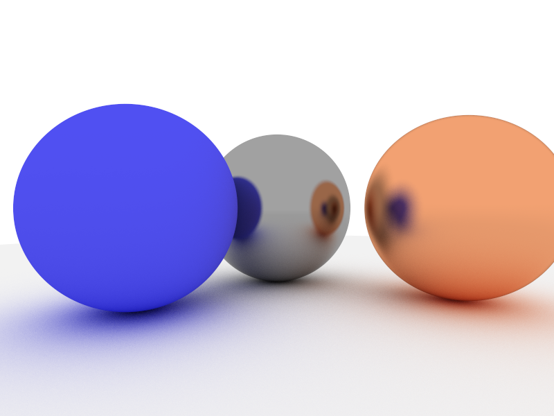

# Simple Ray Tracer

A simple ray tracer written in C++ that can render spherical objects with diffuse and metal materials.

It was made by following the book on [Ray Tracing in One Weekend.](https://github.com/RayTracing/raytracing.github.io)

The ray tracer uses a [small library written by me](https://github.com/erenyesilyurt/bmprinter) to render images into uncompressed .bmp files.

